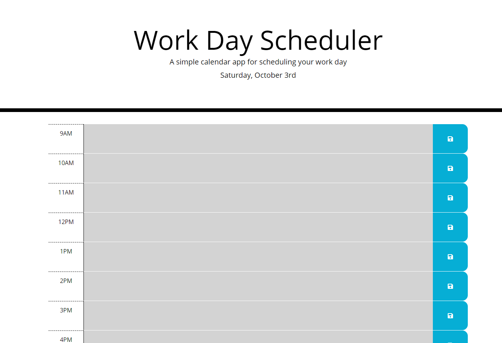

# Day Planner

A planner for the workings hours (9-5) of the current day. Each hour block has a text area for the user to enter tasks/events for that hour. They may save their entries to local storage using the corresponding save button.

The planner also colour codes the hour blocks based on:

- if it is a past hour
- if it is the current hour
- if it is a future hour

An HTML file and CSS file were given as starter code from the bootcamp. A user story and acceptance criteria were also provided.

:link: [Day Planner Website](https://angelicamapeso.github.io/bootcamp-day-planner/)

## Purpose

Based on the given user story, this planner to help busy employees manage their time by scheduling their tasks/events for their day.

## Additional Resources

- [Font Awesome 5](https://fontawesome.com/)
- [Bootstrap 4](https://getbootstrap.com/)
- [Moment.js](https://momentjs.com/)
